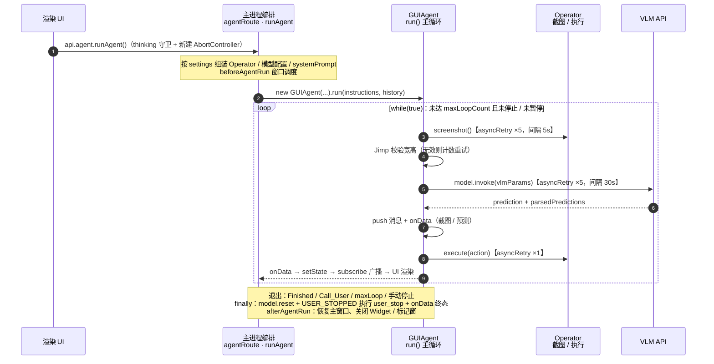

# UI-TARS Desktop Agent 编排执行流程分析

> 基于源码阅读的编排视角梳理：触发守卫 → 编排组装 → 主循环状态机 → 收尾 → 控制通道。
> 关联文档：[agent-run-flow-analysis.md](./agent-run-flow-analysis.md)（端到端视角，含渲染进程发起）、[process-architecture.md](./process-architecture.md)（进程架构）、[architecture-analysis.md](./architecture-analysis.md)（分层技术架构）。

## 1. 流程时序图



## 2. 阶段一：触发与并发守卫

渲染进程 `api.agent.runAgent()` → preload `ipcRenderer.invoke` → 主进程 `agentRoute.runAgent`（`apps/ui-tars/src/main/ipcRoutes/agent.ts`）：

```ts
if (thinking) return;                          // 防并发重入
store.setState({
  abortController: new AbortController(),      // 本次运行的取消句柄
  thinking: true,
  errorMsg: null,
});
await runAgent(store.setState, store.getState); // 进入编排
store.setState({ thinking: false });
```

## 3. 阶段二：编排组装（`apps/ui-tars/src/main/services/runAgent.ts`）

按顺序完成 7 件事：

1. **读取设置**：`SettingStore`（electron-store）取 vlmProvider、operator 类型、maxLoopCount、loopIntervalInMs 等
2. **定义 `onData` 回调**：为对话渲染 SoM 标记图（`markClickPosition`）、本地桌面模式下弹 `showPredictionMarker` 预测窗、把 conversations 合并进 store
3. **四选一创建 Operator**：
   - `LocalComputer` → `NutJSElectronOperator`（desktopCapturer 截屏 + nut-js 键鼠）
   - `LocalBrowser` → 先 `checkBrowserAvailability()` 检查本机 Chrome，失败则置 ERROR 直接返回；成功则取 `DefaultBrowserOperator` 单例
   - `RemoteComputer` / `RemoteBrowser` → 经 `ProxyClient` 连云端沙箱
4. **模型配置**：本地用设置中的 baseURL/apiKey/model；远程模式切换到 `FREE_MODEL_BASE_URL` 并附加鉴权 header
5. **系统提示词**：按模型版本（UI-TARS V1.0/V1.5、豆包 15B/20B）和 operator 类型（computer/browser）选取
6. **实例化 GUIAgent**：重试策略 `model:5 / screenshot:5 / execute:1`，注册进 `GUIAgentManager` 单例（pause/stop 路由据此拿到实例），发送 UTIO 遥测
7. **窗口调度** `beforeAgentRun`：本地模式 → 隐藏主窗口、弹 Widget 控制条 + 水波纹全屏窗

## 4. 阶段三：主循环 `while(true)`（`packages/ui-tars/sdk/src/GUIAgent.ts`）

每轮执行以下步骤：

| 步骤 | 内容 | 失败处理 |
|---|---|---|
| 1. 前置检查 | `isPaused` → 推 `PAUSE` 并挂起在 `resumePromise`；`isStopped`/`signal.aborted` → `USER_STOPPED` 退出；`loopCnt >= maxLoopCount` 或截图连续失败 → ERROR 退出 | 跳出循环 |
| 2. 截图 | `operator.screenshot()`，asyncRetry 最多 5 次（间隔 5s） | Jimp 校验宽高，无效图 `loopCnt--`、`snapshotErrCnt++`，sleep 1s 后重试本轮 |
| 3. 推送截图 | 截图作为 human 消息 push 进 `conversations`，触发 `onData` | — |
| 4. VLM 推理 | `toVlmModelFormat` + `processVlmParams`（消息格式化 + **图片滑窗**控制上下文）→ `model.invoke()`，重试 5 次（间隔 30s），abort 异常直接 bail | 记录 `previousResponseId` 供 Responses API 连续对话 |
| 5. 解析预测 | 空响应 → continue；否则 push gpt 消息（含 `predictionParsed` 动作数组），触发 `onData` | — |
| 6. 逐动作执行 | 遍历 `predictionParsed`，调 `operator.execute({...})`（重试 1 次） | 内部动作 `Error`/`MaxLoop` → ERROR；`Call_User` → 置 `CALL_USER` 跳出；`Finished` → 置 `END` 跳出 |
| 7. 轮间隔 | `sleep(loopIntervalInMs)` 后进入下一轮 | — |

## 5. 阶段四：收尾 finally

- `model.reset()`
- 若 `USER_STOPPED`：额外执行一次 `user_stop` 动作（如释放按住的鼠标）
- 最终 `onData`（空 conversations，只推终态）；ERROR 时走 `onError` 回调写入 store
- 回到阶段一入口：`afterAgentRun` 恢复主窗口、关闭 Widget / 标记窗 / 水波纹，`thinking: false`

## 6. 贯穿全程的旁路通道

- **状态回流**：每次 `onData` → `store.setState` → store 订阅 → `windowManager.broadcast` → 渲染进程 `zustandBridge` → React 更新
- **运行中控制**（`apps/ui-tars/src/main/ipcRoutes/agent.ts`）：
  - `pauseRun` / `resumeRun`：操作 GUIAgent 的 pause promise
  - `stopRun`：置 END → `abortController.abort()` → `agent.resume()+stop()` → `closeScreenMarker()`；托盘菜单直接调用同一路由（主进程内部调用）

## 7. 总结

一次 `runAgent` = **组装**（Operator 四选一 + 提示词 + 重试策略 + 窗口调度）→ **`while(true)` 循环**【截图 → VLM → 解析 → 执行】→ 由 **`Finished` / `Call_User` / maxLoop / 手动停止**四类条件退出 → **finally 统一收尾**；全程经 `onData` 把中间状态实时扇出到全局 store 与 UI。
