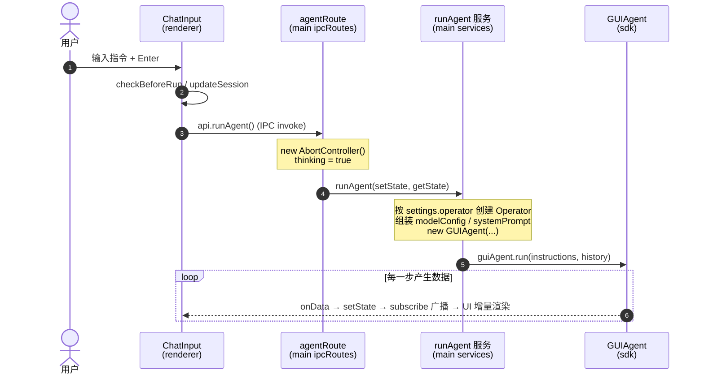
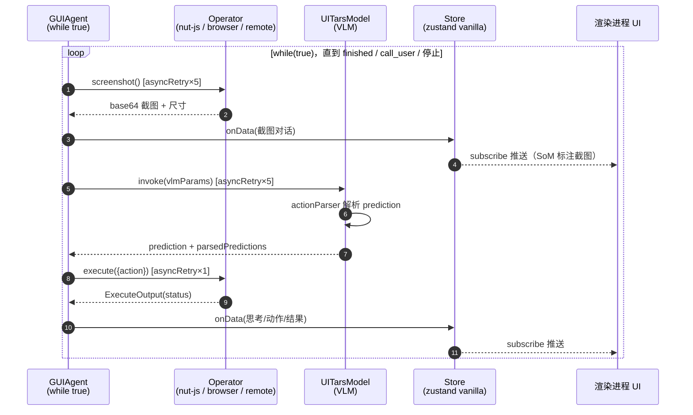

# UI-TARS Desktop：从用户输入命令到 Agent 完成任务的完整流程分析

> 基于源码阅读的运行时流程梳理：端到端链路、序列图、涉及的类/文件/关键代码，以及终止条件。
> 姊妹篇：[architecture-analysis.md](./architecture-analysis.md)（分层技术架构分析）。

## 1. 端到端流程总览

整个链路分三个阶段：

**阶段 1 — 命令发起（渲染进程）**
用户在 `/local` 页 `ChatInput` 输入指令按 Enter → `startRun()` → `checkBeforeRun`（检查 VLM 配置）→ `updateSession`（session 名=指令）→ `useRunAgent` 的 `run()`：本地 Operator 先做 accessibility/screenCapture 权限检查，把历史对话转成 Message，通过 4 个 IPC 调用（setInstructions / setMessages / setSessionHistoryMessages / runAgent）进入主进程。

**阶段 2 — Agent 组装与执行（主进程 + SDK）**
`agentRoute` 的 `runAgent` handler 创建 `AbortController`、置 `thinking:true` → `runAgent` 服务按 `settings.operator` 创建对应 Operator（本地电脑/本地浏览器/远程），组装 modelConfig 与 systemPrompt → `new GUIAgent({...})` → `guiAgent.run(instructions, history)` 进入 ReAct 循环：**截图 → VLM 推理 → actionParser 解析动作 → operator.execute 执行 → onData 回推**，直到满足终止条件。

**阶段 3 — 状态回传（回到 UI）**
SDK 每一步通过 `onData` 回调 → `store.setState`（vanilla zustand）→ `main.ts` 的 `store.subscribe` → `windowManager.broadcast` 的 `webContents.send('subscribe', state)` → preload 的 `zustandBridge` → 渲染端 `useStore` → React 组件重渲染（截图、思考链、动作标记）。

## 2. 序列图

### 2.1 启动链路（用户输入 → GUIAgent.run）



### 2.2 执行循环（GUIAgent 内部 ReAct 循环）



## 3. 涉及的类、文件及职责

### 3.1 渲染进程（`apps/ui-tars/src/renderer`）

| 类/函数 | 文件 | 职责 |
|---|---|---|
| `ChatInput` | `src/renderer/src/components/ChatInput/index.tsx` | 指令输入入口；CALL_USER 状态显示 Play 重发上一条指令，running 显示 Stop |
| `useRunAgent` | `src/renderer/src/hooks/useRunAgent.ts` | 权限检查、历史消息转换、发起 IPC 调用 |
| `createClient<Router>` | `src/renderer/src/api.ts` | 类型化 IPC 客户端（`@ui-tars/electron-ipc`） |
| `useStore / getState` | `src/renderer/src/hooks/useStore.ts` | 订阅 'subscribe' 通道，同步主进程 zustand 状态 |
| Local 页 | `src/renderer/src/pages/local/index.tsx` | 渲染消息流：HumanTextMessage / ScreenshotMessage / ThoughtChain / ErrorMessage 等 |
| Home 页 | `src/renderer/src/pages/home/index.tsx` | 选择 Local/Remote Operator，createSession 后导航到 /local |

### 3.2 IPC 桥（`src/preload` + `packages/ui-tars/electron-ipc`）

| 组件 | 文件 | 职责 |
|---|---|---|
| `zustandBridge` | `src/preload/index.ts` | contextBridge 暴露 `getState`（invoke 'getState'）与 `subscribe`（监听 'subscribe' 通道） |
| `t.router / t.procedure` | `packages/ui-tars/electron-ipc/src/types.ts` | 主进程路由定义；渲染端 `createClient` 生成类型安全调用 |

### 3.3 主进程（`apps/ui-tars/src/main`）

| 类/函数 | 文件 | 职责 |
|---|---|---|
| `agentRoute` | `src/main/ipcRoutes/agent.ts` | runAgent / pauseRun / resumeRun / stopRun handler；stop 时 `abortController.abort()` + `guiAgent.resume(); guiAgent.stop()` |
| `GUIAgentManager` | `src/main/ipcRoutes/agent.ts` | 单例，持有当前 guiAgent 与 AbortController，跨 handler 共享 |
| `runAgent` 服务 | `src/main/services/runAgent.ts` | 编排核心：按 operator 设置创建 Operator（LocalComputer→`NutJSElectronOperator`；LocalBrowser→`DefaultBrowserOperator`；Remote→`RemoteComputerOperator`/远程浏览器）、组装 modelConfig（远程走 `FREE_MODEL_BASE_URL`+`getAuthHeader`）、生成 systemPrompt、配置 retry（model:5 / screenshot:5 / execute:1）、onData 回调里做 SoM 标注（`markClickPosition`）并 setState |
| `NutJSElectronOperator` | `src/main/agent/operator.ts` | 本地电脑操作：`screenshot()` 用 electron `desktopCapturer` 截屏转 JPEG base64；`execute()` 执行 nut-js 动作（Windows 下 type 走剪贴板+Ctrl+V）；定义 `MANUAL.ACTION_SPACES` |
| AppStore | `src/main/store/create.ts` | vanilla zustand `AppState`：status / messages / instructions / thinking / abortController 等 |
| 状态广播 | `src/main/main.ts` | `ipcMain.handle('getState')`、`ipcMain.on('subscribe')`、`store.subscribe → broadcast` |

### 3.4 SDK（`packages/ui-tars/sdk` + `packages/ui-tars/action-parser`）

| 类 | 文件 | 职责 |
|---|---|---|
| `GUIAgent<T extends Operator>` | `packages/ui-tars/sdk/src/GUIAgent.ts` | ReAct 核心循环；pause/resume/stop（isPaused + resumePromise + isStopped）；终止条件处理；USER_STOPPED 时执行 `user_stop` 动作收尾 |
| `UITarsModel` | `packages/ui-tars/sdk/src/Model.ts` | OpenAI SDK 调用 VLM；`preprocessResizeImage` 图片预处理（按 uiTarsVersion 限 maxPixels）；支持 Responses API（`previous_response_id` 链式 + 头部图片滑窗删除）；`invoke` 末尾用 actionParser 解析 |
| `Operator`（抽象类） | `packages/ui-tars/sdk/src/types.ts` | `static MANUAL` + 抽象 `screenshot()/execute()`；`GUIAgentConfig` 含 maxLoopCount |
| `actionParser` | `packages/ui-tars/action-parser/src/actionParser.ts` | 模型文本预测 → 结构化动作；坐标按 factor/scaleFactor 缩放换算 |

## 4. 关键代码

### 4.1 GUIAgent.run 核心循环骨架（`packages/ui-tars/sdk/src/GUIAgent.ts`）

```ts
async run(instruction, historyMessages, remoteModelHdrs) {
  this.setContext(instruction, historyMessages, remoteModelHdrs);
  while (true) {
    if (this.isPaused) await this.resumePromise;        // 暂停点
    if (this.signal?.aborted || this.isStopped) → USER_STOPPED;
    if (this.loopCnt >= this.config.maxLoopCount) → REACH_MAXLOOP;

    // ① 截图（asyncRetry 5 次；Jimp 校验宽高，失败则重试）
    const { base64, screenWidth, screenHeight, scaleFactor } =
      await asyncRetry(() => this.config.operator.screenshot(), screenshotRetry);
    this.data.conversations.push({ from: 'user', value: screenshotText });
    this.config.onData({ conversations: slice(-1) });   // 回推截图

    // ② VLM 推理（asyncRetry 5 次，AbortError 时 bail）
    const { prediction, parsedPredictions } = await asyncRetry(
      () => this.config.model.invoke(vlmParams), modelRetry);

    // ③ 逐个执行动作
    for (const { action_type, ...parsed } of parsedPredictions) {
      const { status } = await asyncRetry(
        () => this.config.operator.execute({ prediction, parsedPrediction, ... }), executeRetry);
      if (action_type === 'call_user') → StatusEnum.CALL_USER; break;
      if (action_type === 'finished') → StatusEnum.END; break;
    }
    await sleep(this.config.loopIntervalInMs);
  }
}
```

### 4.2 IPC 入口 handler（`apps/ui-tars/src/main/ipcRoutes/agent.ts`）

```ts
runAgent: t.procedure.input(z.void()).mutation(async () => {
  abortController = new AbortController();
  store.setState({ status: StatusEnum.INIT, abortController, thinking: true });
  try {
    await runAgent(store.setState, store.getState);
  } finally {
    store.setState({ thinking: false, abortController: null });
  }
}),
```

### 4.3 渲染端发起（`apps/ui-tars/src/renderer/src/hooks/useRunAgent.ts`）

```ts
const run = async (value, history, callback) => {
  await checkLocalOperatorPermission();               // accessibility / screenCapture
  const messages = filterAndTransformWithMap(history); // 历史转为 session 消息
  await Promise.all([
    api.setInstructions(value), api.setMessages(messages),
    api.setSessionHistoryMessages(history),
  ]);
  await api.runAgent();
};
```

## 5. 终止条件一览

| 条件 | 触发位置 | 结果 |
|---|---|---|
| `finished` 动作 | GUIAgent 循环内 | `StatusEnum.END`，正常结束 |
| `call_user` 动作 | GUIAgent 循环内 | `StatusEnum.CALL_USER`，UI 显示 Play 按钮，用户补充后重发 |
| 循环次数达上限 | `loopCnt >= maxLoopCount` | REACH_MAXLOOP 错误 |
| 用户停止 | ChatInput 的 Stop → `abortController.abort()` + `guiAgent.stop()` | USER_STOPPED，执行 `user_stop` 动作收尾 |
| 截图连续失败 | `snapshotErrCnt >= MAX_SNAPSHOT_ERR_CNT` | 错误终止 |
| 模型重试耗尽 | asyncRetry 5 次失败 | onError 回调 |
