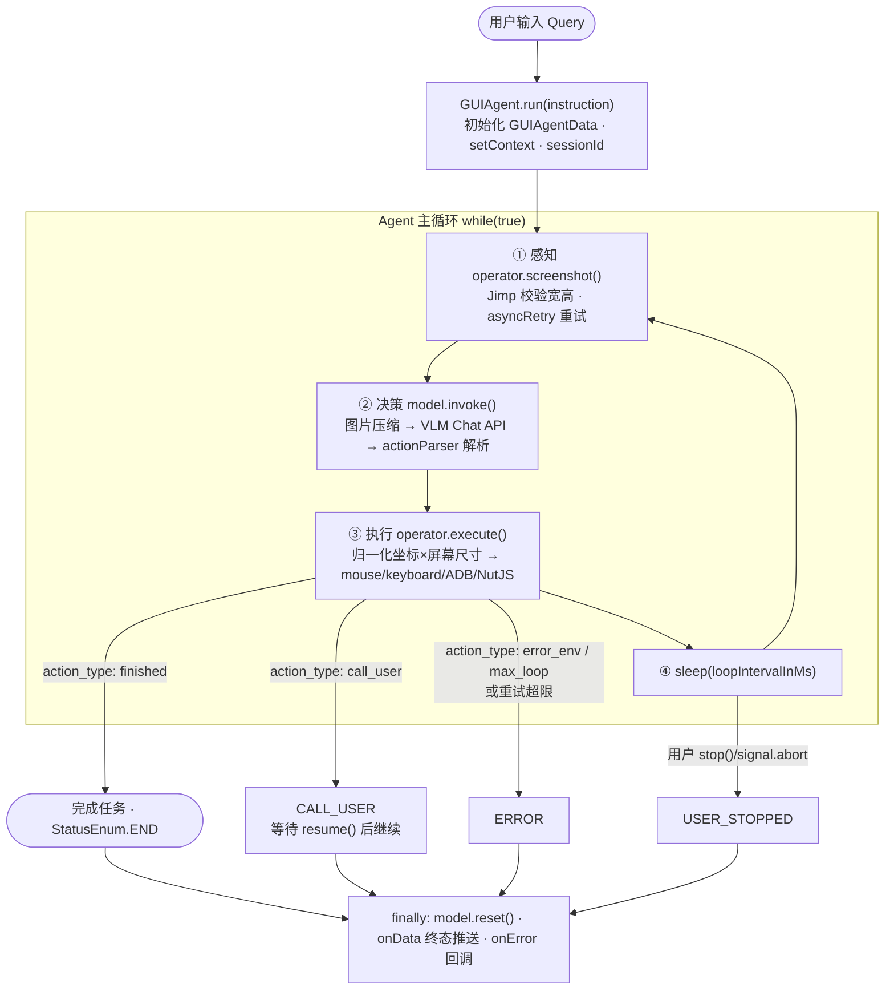

# GUI Agent 操控技术与执行流程分析

> 分析范围：`packages/ui-tars/sdk`（Agent 循环）、`multimodal/gui-agent`（Operator 抽象与三端实现）、`packages/agent-infra`（浏览器基础设施）。本项目是 UI-TARS 范式的 GUI Agent：操控 =「感知（截图）→ 决策（VLM）→ 执行（Operator）」的闭环循环。

## 一、操控技术清单与优先级

### 1.1 核心循环

核心循环位于 `packages/ui-tars/sdk/src/GUIAgent.ts` 的 `while(true)`：

```
截图 → model.invoke() → 解析动作 → operator.execute() → 下一轮
```

### 1.2 技术清单

| 技术 | 用途 | 关键位置 |
|------|------|---------|
| **VLM 视觉定位（UI-TARS 范式）** | 截图注入多模态 LLM，模型直接输出归一化坐标动作（如 `click(start_box='(512,300)')`），无独立 grounding 模块 | `packages/ui-tars/sdk/src/Model.ts`、`browser-gui-agent.ts` |
| **Puppeteer-core（含 CDP）** | 浏览器操控：本地 `launch`（带反检测参数）/ 远程 CDP `connect`；动作映射到 `page.mouse` / `page.keyboard` API（打字带 20-50ms 随机延迟模拟人类） | `packages/agent-infra/browser/src/local-browser.ts`、`browser-operator.ts` |
| **ADB + YADB** | Android 设备操控：tap/swipe/长按/键盘，YADB 解决受限应用截屏 | `multimodal/gui-agent/operator-adb` |
| **NutJS** | 桌面操控：鼠标移动/点击/拖拽、键盘输入、滚动（支持高分屏缩放） | `multimodal/gui-agent/operator-nutjs` |
| **Action Parser** | 把 VLM 输出的动作字符串解析为结构化动作，1000×1000 归一化坐标 → 真实屏幕坐标换算 | `packages/ui-tars/action-parser/src/actionParser.ts` |
| **buildDomTree.js 注入** | DOM 模式感知：`page.evaluate` 注入脚本提取带索引的可交互元素树 + Set-of-Mark 标注 | `packages/agent-infra/browser-use/assets` |
| **Readability 正文提取** | 页面内容转 Markdown（100KB 分页） | `content-extractor.ts` |
| **MCP 协议（in-memory transport）** | Browser 工具以 MCP Server 内嵌运行，共享同一浏览器实例 | `packages/agent-infra/mcp-servers/browser` |

### 1.3 完成任务过程中的技术优先级

**P0 — 决定"能不能操控"（核心范式）**

1. **Agent 循环 + VLM 视觉定位**：整个操控的大脑与眼睛，截图→决策→执行的骨架，缺一不可。
2. **Puppeteer/ADB/NutJS 执行器**：操控的"手"，VLM 的决策必须经此落地；浏览器路径（Puppeteer）是默认主通道。

**P1 — 决定"操控得准不准"（桥梁层）**

3. **Action Parser 坐标换算**：连接模型输出与执行器的翻译官，坐标换算错误则点击必然失败。
4. **重试与容错机制**：`asyncRetry` 包裹截图/模型调用/执行三环节，保证循环鲁棒性。

**P2 — 决定"操控得好不好"（精度增强）**

5. **buildDomTree DOM 提取 + Set-of-Mark**：hybrid/dom 模式下用结构化元素树弥补纯视觉定位的精度损失。
6. **Readability 提取**：内容理解增强，供 LLM 获取干净正文。

**P3 — 工程化组织方式**

7. **MCP 工具协议、策略模式（dom/visual-grounding/hybrid 三种控制模式）**：影响架构灵活性，不影响单次操控能力。

**一句话：视觉优先、DOM 兜底**——VLM 看图输出坐标是主路径（跨端通用：浏览器/Android/桌面同一套动作空间），DOM 提取是浏览器场景下的精度增强，三者通过统一的 `Operator` 抽象解耦。

## 二、Native 应用的感知方式（不提取 DOM）

**结论：DOM 提取是浏览器场景独有的能力，Native 应用（桌面/Android）走纯视觉路径。**

### 2.1 源码证据

**1. `Operator` 抽象层没有元素提取接口**

`multimodal/gui-agent/shared/src/base/operator.ts` 定义的统一抽象只有三个感知/执行方法：

```typescript
export abstract class Operator extends BaseOperator {
  protected abstract screenshot(): Promise<ScreenshotOutput>;   // 唯一的感知手段
  protected abstract execute(params: ExecuteParams): Promise<ExecuteOutput>;
  protected abstract screenContext(): Promise<ScreenContext>;   // 只有分辨率/缩放信息
}
```

没有任何 `getDomTree` / `getElements` 之类的抽象——统一抽象刻意只保留视觉闭环所需的最小接口。

**2. DOM 相关代码只存在于浏览器 Operator**

grep 整个 `gui-agent` 目录，`dom / buildDomTree / selectorMap` 仅命中 `operator-browser/src/browser-operator.ts`；operator-nutjs（桌面）和 operator-adb（Android）零命中。

原因很本质：buildDomTree.js 是通过 `page.evaluate()` 注入到网页 JS 环境里执行的，只有浏览器渲染引擎才有 DOM。Native 应用（Qt 之外的 macOS App、Windows exe、Android View 体系）没有 DOM 环境，注入无从谈起。

**3. 未实现 Accessibility Tree 替代方案**

业界给 Native 应用做结构化增强通常用无障碍树（macOS AX API / Windows UIA / Android AccessibilityService），但本项目未实现。代码中 accessibility 相关命中均为浏览器场景或 Electron 应用自身申请系统权限（屏幕录制/辅助功能授权），不是用来提取元素树的。

### 2.2 两条路径对比

| | 浏览器 | Native（桌面/Android） |
|---|---|---|
| 感知 | 截图（主）+ buildDomTree 元素树 + Readability（增强） | **仅截图** |
| 定位 | VLM 视觉坐标（主）或 index→CSS selector（DOM 模式） | **仅 VLM 视觉坐标** |
| 执行 | `page.mouse` / `page.keyboard` / ElementHandle | NutJS / ADB 坐标级操作 |

这也解释了为什么 UI-TARS 选择"VLM 直接输出坐标"作为统一动作空间——它是对浏览器、桌面、移动端唯一通用的操控范式。

## 三、Query → 任务完成 实现流程

### 3.1 总体流程图



### 3.2 分阶段详解：类与关键代码

#### 阶段 0 — 入口：Query 如何到达 GUIAgent

| 场景 | 入口链路 |
|---|---|
| Electron 桌面应用 | 渲染进程输入 → IPC → 主进程 `useRunAgent` → `GUIAgent.run(query)` |
| Agent TARS | `AgentTARS`（编排层）→ `BrowserGuiAgent`（GUIAgent 浏览器封装）→ 同一循环 |
| 纯 SDK | 直接 `new GUIAgent({ operator, model }).run(query)` |

```typescript
// GUIAgent 构造：注入 Operator（手）与 Model（大脑）
const agent = new GUIAgent({
  operator: new BrowserOperator(...) / new NutJSOperator() / new AdbOperator(),
  model: new UITarsModel({ baseURL, apiKey, model: 'ui-tars-v1.5' }),
  maxLoopCount, loopIntervalInMs, signal, onData, onError,
});
await agent.run('帮我在 GitHub 上搜索 ui-tars 并打开第一个结果');
```

#### 阶段 ① 感知 — `Operator.screenshot()`

**类**：`Operator` 抽象类（`multimodal/gui-agent/shared/src/base/operator.ts`）→ 各端实现。

**关键代码**（`packages/ui-tars/sdk/src/GUIAgent.ts`）：

```typescript
const snapshot = await asyncRetry(() => operator.screenshot(), { retries, minTimeout: 5000 });
const { width, height } = await Jimp.fromBuffer(...);   // 校验图片有效性
if (!isValidImage) { snapshotErrCnt += 1; continue; }    // 连续失败 ≥ MAX_SNAPSHOT_ERR_CNT → ERROR
```

三端实现差异：

- **BrowserOperator**：`page.screenshot({ type: 'jpeg', quality: 75, captureBeyondViewport: false })`
- **NutJSOperator**：NutJS 屏幕捕获（处理高分屏 scaleFactor）
- **AdbOperator**：ADB 截屏，受限应用回退 YADB

#### 阶段 ② 决策 — `UITarsModel.invoke()`

**类**：`UITarsModel`（`packages/ui-tars/sdk/src/Model.ts`，继承 Model 抽象）。

内部四步：

```typescript
// 1. 按模型版本压缩截图（MAX_PIXELS_V1_0 / V1_5 / DOUBAO）
const compressedImages = await Promise.all(
  images.map((image) => preprocessResizeImage(image, maxPixels)),
);
// 2. 组装 OpenAI 格式消息（system prompt + 历史对话 + image_url）
const messages = convertToOpenAIMessages({ conversations, images: compressedImages });
// 3. 调 VLM（OpenAI 兼容；可选 Responses API，支持 previous_response_id 增量 + 滑窗删图省 token）
const result = await openai.chat.completions.create({ model, messages, temperature: 0 });
// 4. 解析动作字符串
const { parsed: parsedPredictions } = actionParser({
  prediction, factor: [1000, 1000], screenContext, scaleFactor,
});
```

**VLM 输出示例与解析**（`packages/ui-tars/action-parser/src/actionParser.ts`）：

```
Thought: 搜索框已定位，输入关键词
Action: type(content='ui-tars', start_box='(512,384)')
```

→ 解析为 `{ action_type: 'type', action_inputs: {content, start_box}, thought }`，坐标为 1000×1000 归一化。

#### 阶段 ③ 执行 — `operator.execute()`

**类**：具体 Operator 实现。**坐标换算**是关键桥梁：

```typescript
// BrowserOperator（multimodal/gui-agent/operator-browser/src/browser-operator.ts）
const { x, y } = calculateRealCoords(parsedPrediction, screenWidth, screenHeight);
await page.mouse.click(x, y);                             // click
await page.keyboard.type(text, { delay: 20-50 随机 });     // type（模拟人类）
await page.mouse.wheel({ deltaY: 0.8 * height });          // scroll
// drag = mouse.down + 10 步插值 move + mouse.up
```

**动作分发**（`GUIAgent.ts` run 方法内）——循环内逐条执行 `parsedPredictions`：

| action_type | 行为 |
|---|---|
| 常规动作（click/type/scroll/drag/hotkey/wait） | `operator.execute()` 落地到对应端 API |
| `error_env` / `max_loop` | 置 ERROR 并 break |
| `call_user` | 置 CALL_USER 并 break（等 `resume()` 后继续循环） |
| `finished` | 置 **END 并 break —— 任务完成的主出口** |

#### 阶段 ④ 循环控制与终止

```typescript
if (loopCnt >= maxLoopCount) → ERROR          // 防失控
await sleep(loopIntervalInMs);                  // 轮间隔
// 循环退出后 finally：
this.model.reset();                             // 清理 Response API 会话
await operator.execute({ action_type: 'user_stop' });  // USER_STOPPED 时通知 operator
await onData?.({ data }); onError?.(...);       // 终态回调
```

其他控制方法：`pause()` 挂起循环（等待 resumePromise）、`resume()` 恢复、`stop()` 置位退出标志。

## 四、总结

- **Query 进入 `GUIAgent.run()` 后，在「截图感知 → VLM 决策（UITarsModel）→ 动作解析（actionParser）→ 执行（Operator）」的 while 循环里逐轮推进，直到模型输出 `finished`（END，主出口）或触发 CALL_USER / ERROR / USER_STOPPED 终态**。
- 跨端（浏览器/桌面/Android）复用同一套循环与动作空间，仅替换 Operator 实现；浏览器场景额外提供 DOM/hybrid 控制模式作为精度增强。
- 操控技术优先级：视觉循环与执行器（P0）> 坐标解析与容错（P1）> DOM/内容提取增强（P2）> MCP 与策略模式等工程化组织（P3）。
