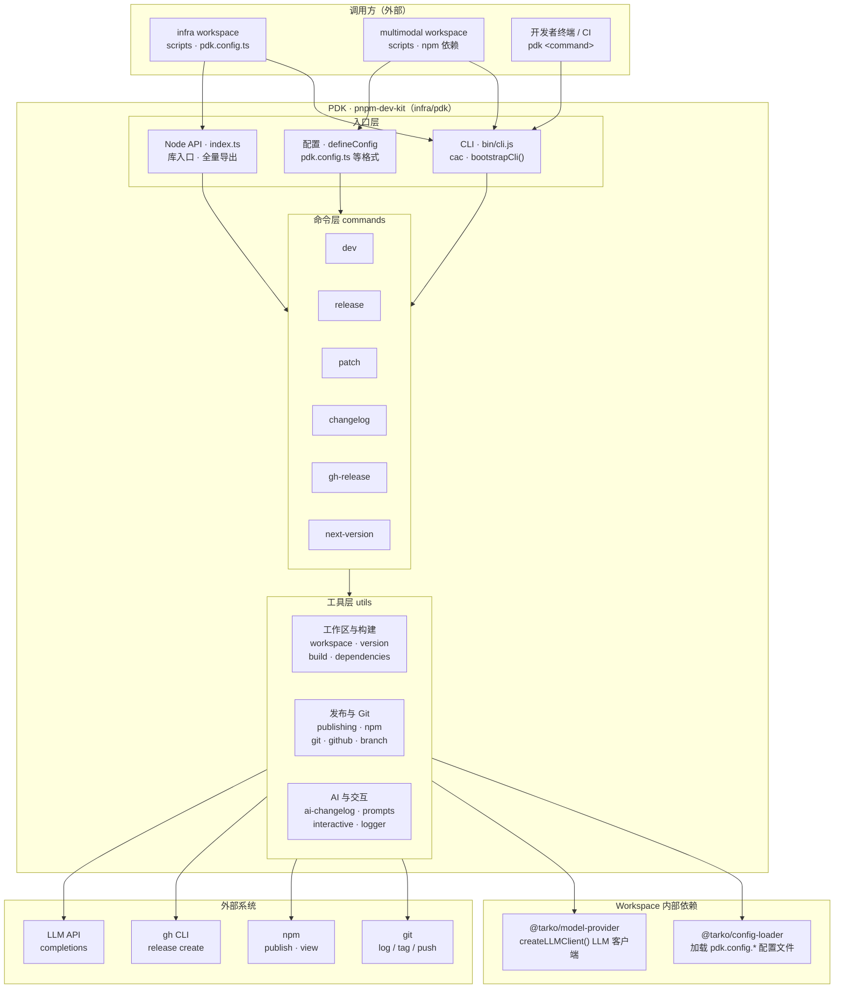
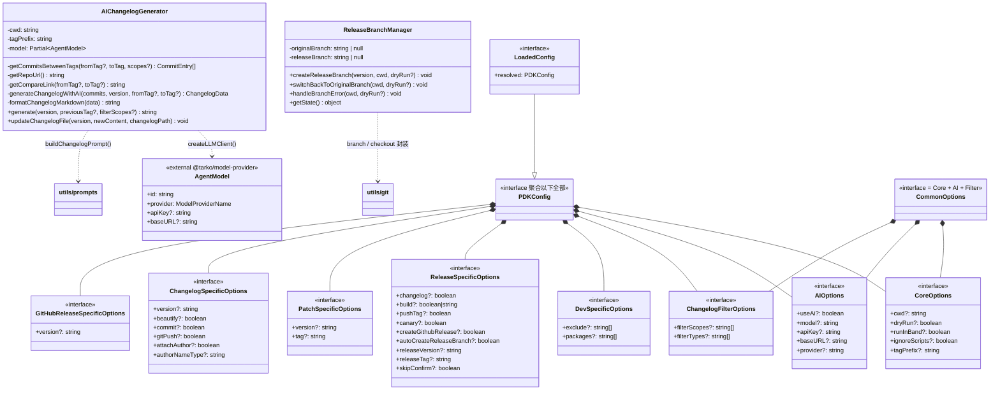
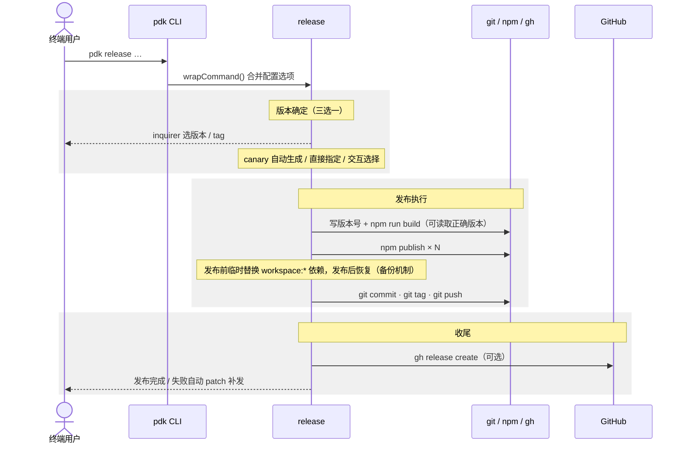
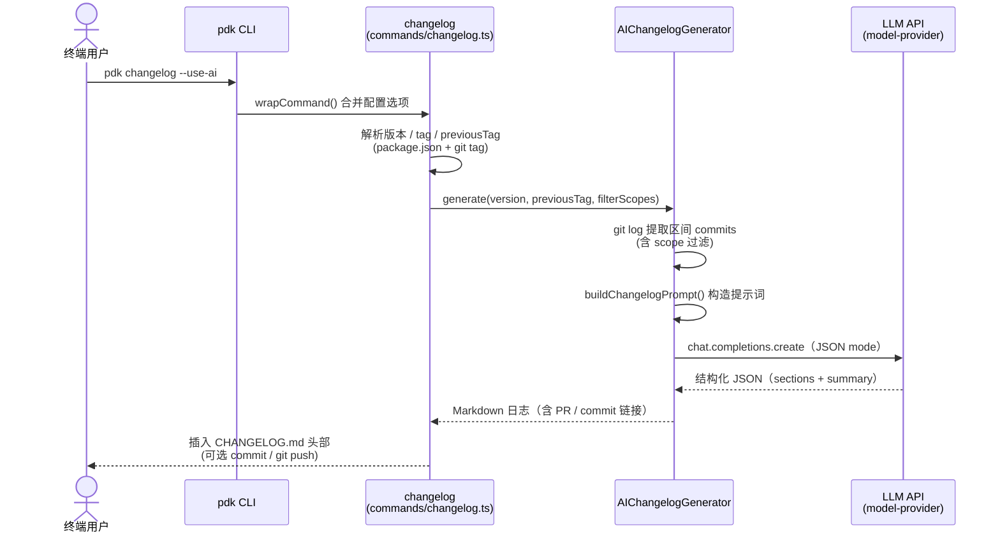
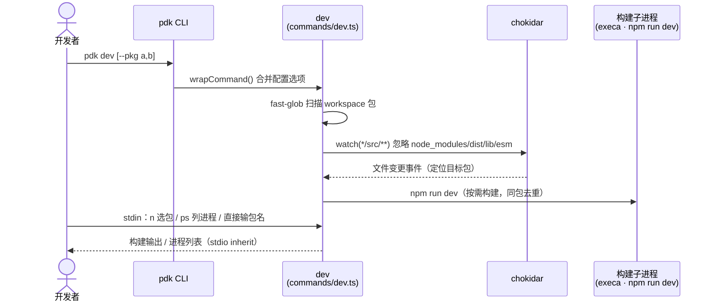

# infra 组件（PDK / pnpm-dev-kit）架构分析

> 分析范围：`/workspace/infra`，核心为 `infra/pdk` 包 —— PDK（pnpm-dev-kit），一个面向 pnpm workspace 的开发与发布工具包，提供 CLI 与 Node API 双形态、同构配置。

## 一、组件架构与外部调用关系

### 1.1 总体架构

PDK 呈「入口层 → 命令层 → 工具层」三层架构：

### 1.2 被哪些组件调用（上游）

| 调用方 | 位置 | 调用方式 |
|---|---|---|
| infra workspace | `infra/package.json` | `devDependencies: pnpm-dev-kit@workspace:*`；scripts 调用 `pdk d / release / changelog / patch / github-release` |
| multimodal workspace | `multimodal/package.json` | npm canary 版本依赖（`0.0.5-canary-*`）；scripts 调用 `pdk d / release / release:ai / patch` 等 |
| 两 workspace 的配置文件 | `infra/pdk.config.ts`、`multimodal/pdk.config.ts` | Node API `defineConfig()` |
| 开发者终端 / CI | `bin: { "pdk": "bin/cli.js" }` | CLI 命令 `pdk <command>` |

### 1.3 调用哪些组件（下游）

| 依赖 | 类型 | 用途 |
|---|---|---|
| `@tarko/config-loader` | workspace 内部包 | `src/utils/config.ts` 加载 `pdk.config.{ts,js,mjs,cjs}` |
| `@tarko/model-provider` | workspace 内部包 | `src/utils/ai-changelog.ts` 通过 `createLLMClient()` 调 LLM 生成 changelog |
| git | 外部系统（execa 子进程） | commit、tag、push、分支管理、log 提取 |
| npm | 外部系统（execa 子进程） | `npm publish`（发布）、`npm view`（查远端版本） |
| gh CLI | 外部系统（execa 子进程） | `gh release create` 创建 GitHub Release |
| LLM API | 外部系统（经 model-provider） | `chat.completions.create`（JSON mode，默认 gpt-4o） |
| cac、inquirer、chokidar、execa、fast-glob、fs-extra、js-yaml、semver、chalk、text-table、string-width、tiny-conventional-commits-parser | 三方库 | CLI 解析、交互确认、文件监听、子进程执行、workspace 扫描、版本计算、commit 解析等 |

## 二、对外提供的接口列表

### 2.1 CLI 接口（`src/cli.ts`，所有命令支持 `--cwd`）

| 命令 / 别名 | 职责 | 关键选项 |
|---|---|---|
| `pdk dev` / `d` | 按需监听构建 monorepo 包 | `--pkg`、`--exclude` |
| `pdk release` / `r` | 版本管理 + 构建发布全流程 | `--canary`、`--dry-run`、`--release-version/--release-tag`、`--build`、`--changelog`、`--push-tag`、`--create-github-release`、`--auto-create-release-branch`、`--use-ai --provider --model --apiKey --baseURL`、`--filter-scopes/--filter-types`、`--skip-confirm`、`--run-in-band`、`--ignore-scripts`、`--tag-prefix` |
| `pdk patch` / `p` | 修复失败的发布（比对远端版本重发） | `--patch-version`、`--tag`、`--run-in-band`、`--ignore-scripts` |
| `pdk changelog` | 生成/更新 CHANGELOG.md | `--changelog-version`、`--use-ai` 及 AI 选项、`--commit`、`--git-push`、`--beautify`、`--attach-author`、`--tag-prefix`、`--dry-run` |
| `pdk github-release` / `gh-release` | 基于 tag 创建 GitHub Release | `--release-version`、`--tag-prefix`、`--dry-run` |
| `pdk next-version` | 列出下一版本候选 | `--cwd` |

CLI 启动流程：`bin/cli.js → bootstrapCli() → cac 注册命令 → wrapCommand()`；`wrapCommand` 统一完成配置加载（`loadPDKConfig`）与合并（`mergeOptions`），并做错误兜底（退出码 1 + logger.error）。

### 2.2 Node.js API（`src/index.ts` 全量导出）

| 导出 | 说明 |
|---|---|
| `bootstrapCli()` | CLI 启动入口（bin 使用） |
| `dev / release / patch / changelog / githubRelease / nextVersion` | 六个命令的编程接口，与 CLI 完全同构 |
| `defineConfig(config)` | pdk.config.* 类型助手 |
| `loadPDKConfig(options)` / `mergeOptions(cli, config)` | 配置加载与合并（优先级：CLI > 环境变量 > 配置文件 > 默认值） |
| `getPreviousTag / generateReleaseNotes / getRepositoryInfo / createGitHubRelease` | GitHub 工具函数 |
| 类型定义 | `PDKConfig`、`LoadedConfig`、`DevOptions`、`ReleaseOptions`、`PatchOptions`、`ChangelogOptions`、`GitHubReleaseOptions`、`WorkspacePackage` 等 |

## 三、本组件类图

PDK 以函数式模块为主，仅有两个类；类型系统采用可组合的 Options 接口设计（CLI / Node API / 配置文件三者完全同构）。

要点说明：

- **`AIChangelogGenerator`**（`src/utils/ai-changelog.ts`）：封装「git log 提取区间提交 → LLM 结构化（JSON mode）→ Markdown 渲染」三段流程。
- **`ReleaseBranchManager`**（`src/utils/branch-manager.ts`）：负责 `release/<version>` 分支的创建、成功后回切原分支、异常时清理。
- 其余 15 个 utils 模块（workspace / version / build / dependencies / publishing / npm / git / github / branch-manager / ai-changelog / prompts / interactive / logger / commit / config）均为函数式设计，由命令层组合调用。
- **Options 类型体系**：`CommonOptions = CoreOptions + AIOptions + ChangelogFilterOptions`，再叠加各命令专属接口派生出 `DevOptions / ReleaseOptions / PatchOptions / ChangelogOptions / GitHubReleaseOptions`；`PDKConfig` 聚合全部接口，`LoadedConfig` 在其上附加 `resolved`（含默认值的最终配置）。

## 四、主要场景时序图

### 4.1 场景一：`pdk release` 发布全流程（核心场景）

关键设计：

1. **版本号统一先写回再构建**：所有包（含根 package.json）先写入目标版本，`build` 脚本执行时可读取正确版本。
2. **workspace 依赖临时替换**：`publishPackages → publishSinglePackage` 对每个包执行「备份 → 替换 `workspace:*` 为目标版本 → 校验无残留 → npm publish → 恢复」，finally 保证恢复。
3. **三种版本确定方式**：`--canary`（`{version}-canary-{commitHash}-{timestamp}`，tag=nightly，跳过交互）、`--release-version + --release-tag` 直接指定、交互式选择（patch/minor/major/beta/alpha/rc/custom + npm tag）。
4. **失败自愈**：发布失败时自动回切原分支（若启用 autoCreateReleaseBranch）并调用 `patch()` 补发未成功的包。
5. `--skip-confirm` 跳过全部交互确认，适用于 CI。

### 4.2 场景二：`pdk changelog --use-ai` AI 变更日志生成

要点：

- AI 链路核心在 `AIChangelogGenerator.generate()`：先用 `git describe` 定位上一个 tag、`git log` 提取区间提交（tag 不存在时回退最近 100 条），再以 JSON mode 调用 LLM（默认 `gpt-4o` / `openai`），解析后渲染为带 PR/commit 链接的 Markdown，插入 `CHANGELOG.md` 头部。
- **非 AI 模式**走 `generateReleaseNotes()`：直接按 conventional commit 类型分组（feat / fix / docs / other）生成 GitHub 风格 release notes，含 `@author`（noreply 邮箱解析 + 手工映射表）与 compare 链接。
- `--filter-scopes` 基于 `tiny-conventional-commits-parser` 解析 scope 过滤提交。
- dry-run 模式下仍会真实执行 AI 生成（仅用于测试预览），非 AI 模式则仅打印预览。

### 4.3 场景三：`pdk dev` 按需监听构建

要点：

- 仅监听各包 `src/` 目录（忽略 `node_modules/dist/lib/esm`），变更触发对应包的 `npm run dev` 子进程。
- 同包进程去重（`processes` 表），子进程退出后自动清理；`SIGINT/exit` 时统一 kill 所有子进程。
- `--pkg` 指定的包启动时立即构建（支持全名/短名/后缀匹配），`--exclude` 排除指定包。
- stdin 交互：`n`（inquirer 列表选包）、`ps`（列出运行中进程 PID）、直接输入包名启动。

### 4.4 场景四（补充）：`pdk patch` 发布修复

流程：读取根 package.json 版本（或 `--patch-version`）→ 清理各包 `gitHead` 字段（防 npm 重复 gitHead 报错）→ `npm view` 并行获取各包远端版本 → 全部一致则直接成功退出 → 否则以表格展示「已发布/未发布」状态 → inquirer 确认 → 对未发布的包（串行 runInBand / 并行）执行 `npm publish`。

## 五、总结

- `infra` 组件即 **PDK（pnpm-dev-kit）**，一个自举的 monorepo 开发/发布工具包：infra 用它发布自身（workspace 依赖），multimodal 用 npm canary 版本。
- 整体呈清晰的**入口层 → 命令层 → 工具层**三层架构；CLI 与 Node API 完全同构，配置优先级为 CLI > 环境变量 > 配置文件 > 默认值。
- 上游调用方：infra / multimodal 两个 workspace（scripts + `pdk.config.ts`）与终端/CI；下游依赖 workspace 内的 `@tarko/config-loader`、`@tarko/model-provider`，并通过 execa 调用 git / npm / gh CLI 三个外部系统。
- 代码风格：仅 `AIChangelogGenerator`、`ReleaseBranchManager` 两个类，其余为函数式模块；类型系统用可组合的 Options 接口（`PDKConfig` 聚合 8 个子接口）。
- 三个核心场景：release 全流程（版本写入 → 构建 → 依赖替换发布 → git tag → GitHub Release，失败自动 patch 与分支回切）、AI changelog（git log → prompt → LLM JSON → Markdown）、dev 按需构建（chokidar 监听 src 变更 + stdin 交互）。
