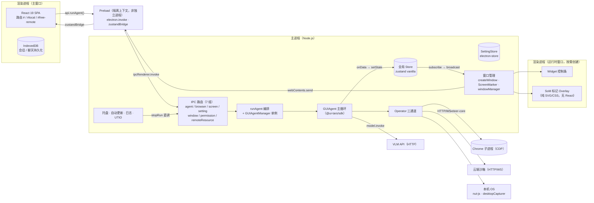

# UI-TARS Desktop 运行时进程架构分析

> 基于源码阅读的进程架构梳理：运行时有几个进程、每个进程对应的组件、以及相互之间的调用关系。
> 关联文档：[architecture-analysis.md](./architecture-analysis.md)（分层技术架构）、[agent-run-flow-analysis.md](./agent-run-flow-analysis.md)（端到端运行流程）、[agent-orchestration.md](./agent-orchestration.md)（Agent 编排执行流程）。

## 1. 进程清单

| 进程 | 数量 | 说明 |
|---|---|---|
| 主进程（Node.js） | 1 | 应用核心，全部业务逻辑与 Agent 执行 |
| 渲染进程（Chromium） | N（按需创建） | 主窗口、Widget 悬浮窗、SoM 标记 Overlay、水波纹动画窗口 |
| Chrome 子进程 | 0~1 | 仅选择"本地浏览器"模式时由 puppeteer-core 启动 |
| Preload | — | **不是独立进程**，运行在每个渲染进程的隔离上下文中 |

> 另有 Electron 框架自身的 GPU 进程 / utility 进程，属于框架默认行为，不属于业务架构。

## 2. 进程架构图

## 3. 各进程组件明细

### 3.1 主进程（Node.js）

| 组件 | 位置 | 职责 |
|---|---|---|
| 应用生命周期与初始化 | `apps/ui-tars/src/main/main.ts` | 日志、菜单、托盘、自动更新、初始化 store 与 IPC 注册 |
| IPC 路由层 | `apps/ui-tars/src/main/ipcRoutes/index.ts` | `@ui-tars/electron-ipc` 的 `registerIpcMain` 注册 agent / browser / screen / setting / window / permission / remoteResource 七组路由（`ipcMain.handle`） |
| Agent 编排 | `apps/ui-tars/src/main/ipcRoutes/agent.ts` + `src/main/services/runAgent.ts` | `GUIAgentManager` 单例 + `runAgent` 编排（组装 GUIAgent） |
| 全局状态 | `apps/ui-tars/src/main/store/create.ts` | zustand vanilla store（单一状态源），`getState`/`subscribe` IPC 通道 |
| 设置持久化 | `src/main/store/setting.ts` | SettingStore（electron-store） |
| Operator 实现 | `src/main/agent/operator.ts`、`src/main/remote/operators.ts` | 本地桌面：`NutJSElectronOperator`（desktopCapturer 截屏 + `@computer-use/nut-js` 键鼠）；本地浏览器：`@ui-tars/operator-browser`（puppeteer-core，拉起 Chrome 子进程）；远程：`RemoteComputerOperator` / `RemoteBrowserOperator`（HTTP/WS 云端沙箱） |
| 窗口管理 | `src/main/window/createWindow.ts`、`ScreenMarker.ts`、`src/main/services/windowManager.ts` | 主窗口（hash 路由 `#` / `#local` / `#free-remote`）、SoM 预测标记 / Widget / 水波纹窗口的动态创建销毁、状态广播 |
| 托盘 / 更新 / 遥测 | `src/main/tray.ts`、AppUpdater、UTIOService | 托盘菜单（停止 = 主进程内部直调 `server.stopRun()`）、electron-updater（GitHub Releases）、UTIO 遥测 |

### 3.2 渲染进程（每个窗口一个）

| 组件 | 位置 | 职责 |
|---|---|---|
| 主窗口 React SPA | `apps/ui-tars/src/renderer/src/App.tsx` | React + HashRouter；聊天输入、运行消息、设置页 |
| api 客户端 | `src/renderer/src/api.ts` | `createClient<Router>` 类型安全 RPC，调用主进程路由 |
| IndexedDB | `src/renderer/src/db/` | 会话（`session.ts`）与聊天记录（`chat.ts`）持久化 |
| zustandBridge 消费 | `src/renderer/src/hooks/useStore.ts` | 订阅主进程推送的状态增量并重渲染 |
| Widget 窗口 | `#widget` 路由 | 运行时悬浮控制条（暂停 / 继续 / 停止） |
| Overlay / 水波纹窗口 | `data:` URL 加载纯 SVG/CSS | SoM 标记框与水波纹动画，无 React |

### 3.3 Chrome 子进程

由 `packages/ui-tars/operators/browser-operator/src/browser-operator.ts` 中 `browser.launch()`（`@agent-infra/browser` → puppeteer-core）拉起，通过 CDP 协议受控（截屏、点击、输入）。仅本地浏览器模式存在。

## 4. 进程间调用关系

1. **UI 发起任务（主调用链）**：渲染进程 `api.runAgent()` → preload `ipcRenderer.invoke` → 主进程 IPC 路由 → `runAgent()` → `GUIAgent.run()` 启动循环（截图 → VLM 推理 → 解析 → 执行）。
2. **Agent 与外部交互**：GUIAgent 调 `model.invoke()` 走 HTTP 访问 VLM API；调 `operator` 分发三条通道——nut-js（本地桌面，原生调用无子进程）、CDP（Chrome 子进程）、HTTP/WS（云端沙箱）。
3. **状态回流（订阅广播）**：GUIAgent `onData` → `store.setState()` → `store.subscribe` → `windowManager.broadcast` 经 `webContents.send` 推给所有已注册窗口 → 渲染进程 `zustandBridge` 更新 React UI。
4. **主进程内部直接调用**：托盘点击"停止"不经过 IPC，直接调用 `server.stopRun()`（同一路由的本地引用）。
5. **窗口间协作**：主进程按需创建 Widget / Overlay 窗口（执行动作时显示 SoM 标记与水波纹），随运行状态销毁。

## 5. 设计要点

- **主进程是唯一状态源和 Agent 执行体**，渲染进程是纯展示 / 交互层。
- 全部通信收敛在两条通道上：一条类型安全的 IPC 请求通道（`invoke`），一条状态订阅广播通道（`subscribe`）。
- Preload 只做桥接（`contextBridge`），不承载业务，因此不是独立进程。
